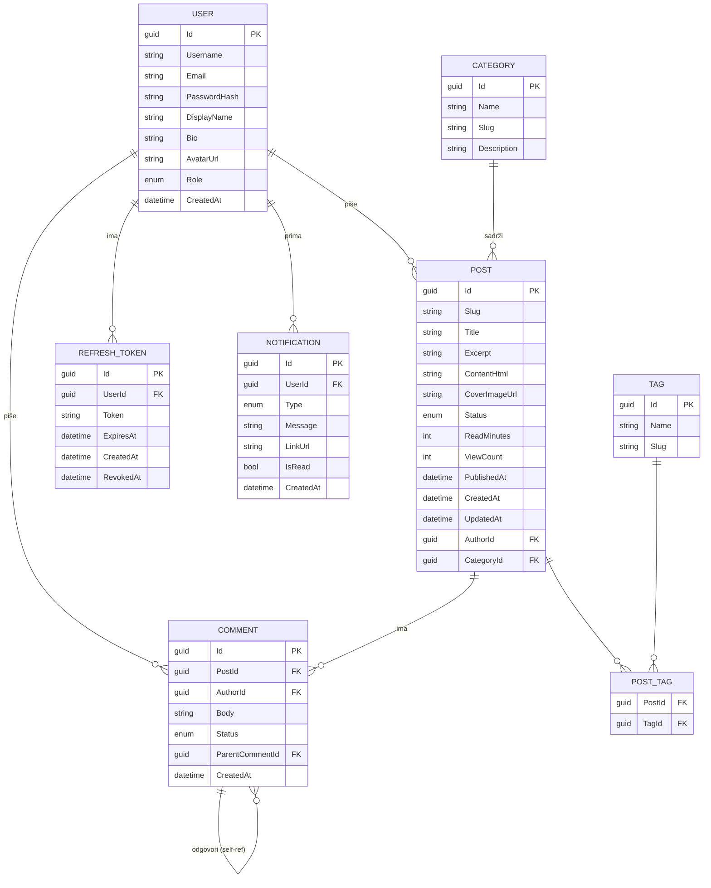

# Blog-Angular-Net

Full-stack blog aplikacija — **Angular 20 SPA** + **.NET 10 Web API**, sa
JWT autentifikacijom, SQL Server bazom preko EF Core, real-time notifikacijama (SignalR) i admin
panelom za upravljanje sadržajem. Razvijen kao portfolio projekat.

## Sadržaj

- [Tehnologije](#tehnologije)
- [Arhitektura](#arhitektura)
- [ERD — model baze](#erd--model-baze)
- [Funkcionalnosti](#funkcionalnosti)
- [API površina](#api-površina)
- [Pokretanje (lokalni razvoj)](#pokretanje-lokalni-razvoj)
- [Pokretanje (Docker)](#pokretanje-docker)
- [Testovi](#testovi)
- [Podrazumevani admin nalog](#podrazumevani-admin-nalog)

## Tehnologije

**Backend**
- .NET 10, ASP.NET Core Web API
- Entity Framework Core 10 + SQL Server
- Clean Architecture (Domain / Application / Infrastructure / Api)
- AutoMapper, FluentValidation
- Custom JWT (access + refresh tokeni) + BCrypt hashing, role-based autorizacija (Reader/Author/Admin)
- SignalR (real-time notifikacije i live komentari)
- xUnit + Moq (unit testovi)

**Frontend**
- Angular 20 (standalone komponente, signali, lazy-loaded rute)
- `@microsoft/signalr` klijent
- Jasmine + Karma (unit testovi)

**Infrastruktura**
- Docker / Docker Compose (SQL Server + API + Angular/nginx)

## Arhitektura

```
backend/
  Blog.Domain/          entiteti, enumi, repository interfejsi (bez zavisnosti)
  Blog.Application/      servisi, DTO-ovi, AutoMapper profili, FluentValidation validatori
  Blog.Infrastructure/   AppDbContext, EF konfiguracije i migracije, repozitorijumi, JWT/BCrypt, seederi
  Blog.Api/             kontroleri, SignalR hub, middleware, Program.cs
  Blog.Application.Tests/  xUnit testovi za Application sloj

frontend/
  src/app/
    core/        modeli, servisi (HTTP + SignalR), interceptori, guard-ovi
    features/    blog (home/post-list/article), auth (login/register), admin (lazy, role-guarded)
    shared/      header/footer/back-to-top komponente
```

Zavisnosti idu u jednom smeru: `Api → Application → Domain`, `Infrastructure → Application/Domain`,
`Api → Infrastructure` (samo za DI wiring u `Program.cs`).

## ERD — model baze



## Funkcionalnosti

- **Autentifikacija**: registracija, login, refresh/rotacija tokena, logout; role Reader/Author/Admin.
- **Javni blog**: lista postova sa pretragom, filterima po kategoriji/tagu i paginacijom; detalj posta.
- **Komentari**: čitaoci ostavljaju komentare (status `Pending` dok ih admin ne odobri).
- **Real-time (SignalR)**: autor posta dobija notifikaciju kada neko komentariše njegov post; live
  dodavanje odobrenih komentara na otvorenom postu, bez refresh-a.
- **Admin/Author panel** (`/admin`, role-guarded): CRUD postova (draft/publish), moderacija
  komentara, upravljanje kategorijama.
- **Validacija**: FluentValidation na svim ulaznim DTO-ovima (registracija, login, post, komentar,
  kategorija) — vraća `400 application/problem+json` sa greškama po polju.

## API površina

| Oblast | Endpoint-i |
|---|---|
| Auth | `POST /api/auth/register`, `/login`, `/refresh`, `/logout`, `GET /api/auth/me` |
| Posts | `GET /api/posts`, `GET /api/posts/{slug}`, `GET/POST/PUT/DELETE /api/posts` (manage), `POST /api/posts/{id}/publish` |
| Categories | `GET /api/categories`, `POST /api/categories` (Admin) |
| Tags | `GET /api/tags` |
| Comments | `GET/POST /api/posts/{id}/comments`, `PUT /api/comments/{id}/moderate`, `DELETE /api/comments/{id}` |
| Notifications | `GET /api/notifications`, `/unread-count`, `POST /api/notifications/read-all` |
| SignalR | `/hubs/notifications` — `ReceiveNotification`, `CommentAdded` |

Swagger UI je dostupan na `/swagger` u Development okruženju.

## Pokretanje (lokalni razvoj)

**Preduslovi**: .NET 10 SDK, Node 22+, SQL Server LocalDB (deo SQL Server Express/Developer edicije).

1. Backend tajne — kopiraj `backend/Blog.Api/appsettings.Local.json` (gitignored) sa connection
   string-om i JWT secret-om:
   ```json
   {
     "ConnectionStrings": {
       "DefaultConnection": "Server=(localdb)\\MSSQLLocalDB;Database=BlogDb;Trusted_Connection=True;MultipleActiveResultSets=true;TrustServerCertificate=True"
     },
     "Jwt": {
       "Secret": "dev-only-blog-jwt-secret-change-in-production-0123456789abcdef"
     }
   }
   ```
2. Pokreni backend (migracije i seed se primenjuju automatski na startu):
   ```sh
   dotnet run --project backend/Blog.Api
   ```
   API je na `http://localhost:5007`, Swagger na `http://localhost:5007/swagger`.
3. Pokreni frontend:
   ```sh
   cd frontend
   npm install
   npm start
   ```
   Aplikacija je na `http://localhost:4200`.

## Pokretanje (Docker)

Iz root direktorijuma:

```sh
docker compose up --build
```

Pokreće tri kontejnera:
- `mssql` — SQL Server 2022 (port 1433)
- `api` — .NET 10 backend (port 5007 → 8080), automatski primenjuje migracije i seed pri startu
- `frontend` — Angular build servira nginx (port 4200), proksira `/api` i `/hubs` ka `api` servisu

Aplikacija je dostupna na `http://localhost:4200`. JWT secret i SA lozinka se mogu prilagoditi
preko env varijabli `JWT_SECRET` i `MSSQL_SA_PASSWORD` (vidi `docker-compose.yml`).

## Testovi

```sh
# Backend (xUnit)
dotnet test backend/Blog.slnx

# Frontend (Jasmine/Karma)
cd frontend
npm test
```

## Podrazumevani admin nalog

Seed kreira admin nalog za prijavu:

- **Korisničko ime**: `luka`
- **Lozinka**: `Admin123!`
